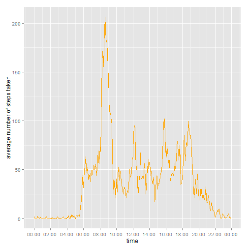
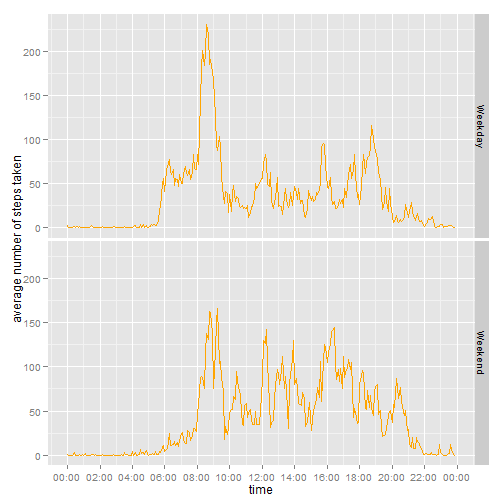

###Loading and preprocessing the data  
  
To start the analysis, the data are read (a csv file),
and then a column "time", based on the "interval" values, is added.  
Basically, "5" is translated into "00:05", "10" into "00:10" and so forth.  
To do so, the interval-values are padded to the left with zeroes (so "5" becomes "0005"),
and then this gets evaluated as "hh:mm" (so "0005" becomes "00:05").


```r
activity_data<-read.csv("./data/activity.csv")
activity_data$date<-as.Date(activity_data$date)
require(stringr)
activity_data$time<-str_pad(activity_data$interval,4,side="left",pad="0")
activity_data$time<-as.POSIXct(strptime(activity_data$time,"%H%M"))
```

###Number of steps taken per day  
  
The first graph is a histogram.  
Grouped by date, the number of steps taken on each day are summed,  
and then plotted in a histogram (binwidth=1000).


```r
require(dplyr)
require(ggplot2)
require(scales)

daily_activity_steps<-activity_data %>% group_by(date) %>% summarise(total=sum(steps))

g<-ggplot(daily_activity_steps, aes(x=total))+geom_histogram(fill="steelblue",colour="black", binwidth=1000)+scale_x_continuous(labels = comma)+scale_y_continuous(breaks= pretty_breaks())
g<-g+xlab("number of steps taken in 1 day")+ylab("number of days")
g
```

 
  

  
Next, the mean and the median of the number of steps taken per day are calculated.  
  
  

```r
mean<-format(mean(daily_activity_steps$total, na.rm=T),scientific=FALSE, digits=0,big.mark=",")
median<-format(median(daily_activity_steps$total, na.rm=T), scientific=F, digits=0, big.mark=",")
```
  
The mean of the number of steps per day is 10,766;  
the median is 10,765.

  
###Average daily activity pattern  
  
The second graph shows a time series plot of the 5-minute interval (x-axis)  
and the average number of steps taken, averaged across all days (y-axis).  


```r
require(dplyr)
require(ggplot2)
require(scales)

interval_activity_steps<<-activity_data %>% group_by(time) %>% summarise(average_steps=mean(steps, na.rm=T))

g<-ggplot(interval_activity_steps, aes(time, average_steps, group=1))+ geom_line(colour="orange")+scale_x_datetime(breaks = date_breaks("2 hour"), labels = date_format("%H:%M"))+ylab("average number of steps taken")
g
```

 
  
  
  

```r
interval_max <- format(interval_activity_steps[which(interval_activity_steps$average_steps==max(interval_activity_steps$average_steps)),1],"%H:%M")
```

The interval with the most number of steps per day is 08:35.  
  
###Imputing missing values  
  
Next, missing data is investigated...  
  
  

```r
numberofNAs <- sum(is.na(activity_data$steps))
numberofNotNAs <- sum(!is.na(activity_data$steps))
```

The number of missing data is 2304.  


```r
missing_data<-activity_data %>% group_by(date) %>% summarise(NA_Count=sum(is.na(steps))) 
missing_days<-missing_data[which(missing_data$NA_Count>0),]
library(knitr)
kable(missing_days,'markdown')
```

```
## 
## 
## |date       | NA_Count|
## |:----------|--------:|
## |2012-10-01 |      288|
## |2012-10-08 |      288|
## |2012-11-01 |      288|
## |2012-11-04 |      288|
## |2012-11-09 |      288|
## |2012-11-10 |      288|
## |2012-11-14 |      288|
## |2012-11-30 |      288|
```


As there are 288 5-minute intervals in a day, it is clear there is missing data for 8 (full) days.    
(8 x 288 = 2,304)  


When replacing the missing data by the average number of steps taken in __that__ interval,
a new DF is created.


```r
require(dplyr)
activity_data_imputed<-activity_data %>% group_by(time) %>% mutate(steps = ifelse(is.na(steps), mean(steps, na.rm=TRUE), steps))
```
  
To investigate the effect of replacing the missing data, a new histogram is created.  
    
    

```r
require(dplyr)
require(ggplot2)
require(scales)

all_steps_imputed<-activity_data_imputed %>% group_by(date) %>% summarise(total=sum(steps))

g2<-ggplot(all_steps_imputed, aes(x=total))+geom_histogram(fill="steelblue",colour="black", binwidth=1000)+scale_x_continuous(labels = comma)+scale_y_continuous(breaks= pretty_breaks())
g2<-g2+xlab("number of steps taken in 1 day")+ylab("number of days")
g2
```

 

Looking at this new histogram, it is, clearly,  __very__ similar to the first one created.  
(in fact, only the count of days where the number of steps is between 10,000 and 11,000 is increased (by 8))...
    

```r
mean_2<-format(mean(all_steps_imputed$total, na.rm=T),scientific=FALSE, digits=0, big.mark=",")
median_2<-format(median(all_steps_imputed$total, na.rm=T),scientific=FALSE, digits=0, big.mark=",")
```
  

The mean of the number of steps per day is 10,766 (compare with the original 10,766);
the median is 10,766 (compare with the original 10,765).  
The fact that the mean has __not__ changed at all is, of course, not surprising,  
given the fact that the missing values were replaced *with the average value*...  
For more on this, see [this wikipedia entry](http://en.wikipedia.org/wiki/Imputation_(statistics))  

###Differences in activity patterns between weekdays and weekends  

To investigate the difference between weekdays and weekends,  
two new columns are added:  
1. the first one, "weekday" is just the name of the day   
2. the second one, "weekendflag" is a factor with 2 potential values (weekend, or weekday)  
  
  
Next a panel plot is created (using ggplot with facets), to compare the activity during weekends and weekdays.  
  
  

```r
require(dplyr)
activity_data_imputed$weekday<-weekdays(activity_data_imputed$date)
activity_data_imputed$weekendflag<-ifelse(activity_data_imputed$weekday=="Saturday" | activity_data_imputed$weekday=="Sunday", "Weekend","Weekday" )
activity_data_imputed$weekendflag<-as.factor(activity_data_imputed$weekendflag)

interval_activity_weekendflag_steps<-activity_data_imputed %>% group_by(time, weekendflag) %>% summarise(average_steps=mean(steps))
g2<-ggplot(interval_activity_weekendflag_steps, aes(time, average_steps, group=1))+ geom_line(colour="orange")+scale_x_datetime(breaks = date_breaks("2 hour"), labels = date_format("%H:%M"))+ylab("average number of steps taken")+facet_grid(weekendflag~.)
g2
```

 
  
As can be expected, the activity in the weekends is not as concentrated in the early morning,  
but instead more spread out evenly during the day...  
  
  
